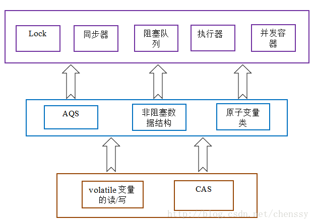

# 学习笔记

## java基础

1.List和Set的区别

>List有序可重复，Set无序不重复

2.HashSet是如何保证不重复的
>HashSet是包装了HashMap的，先通过key的哈希值定位到table数组上，如果数组上已存在，则通过equals方法判断，插入到链表上或者是红黑树中。

3.HashMap是线程安全的吗，为什么不是线程安全的（最好画图说明多线程环境下不安全）

>a.插入值的时候，高并发的情况下在put()值A可能会在Entry数组的同一个位置，如果多线程同时都判断这个位置恰好都没有值的话，最后一个线程put的值会覆盖前面的值，造成数据丢失。

>b.扩容调用resize()的时候，可能会产生循环链表，造成死循环。

4.HashMap的扩容过程
>a.根据当前大小扩容，一般都是当前大小的二倍。

>b.会重新计算hash值，重新散列到Entry数组上。 

5.HashMap1.7和1.8的区别，说明1.8做了哪些优化，如何优化的
>区别在HashMap1.7采用的是数组加链表的形式存储数据的；HashMap1.8做了优化，在链表超过八个元素时，就会将链表转换成红黑树的数据结构。

6.final finally finalize  
>final 定义变量，第一次赋值之后不能更改；finally是配合 try catch 使用的，将程序最终需要的操作都放在finally里面，比如关闭连接等。finalize是对象在被回收标记之后最后一次逃逸垃圾回收的机会。

7.强引用、软引用、弱引用，虚引用
>强引用即使内存不够如果不满足条件也不会回收；软引用在内存不足时进行回收；弱引用在每次gc时都会进行回收；虚引用主要是用来追踪垃圾回收过程的。

8.java反射
>反射是通过类信息即.class文件生成类对象的过程，实现了动态进行对象创建，很对技术都是基于java反射的，比如动态代理。

## java并发
1.synchronized 的实现原理以及锁优化？
>偏向锁：适合于一个线程访问的资源

>轻量级锁：快速响应，当并发量比较高时会升级成重量级锁，会采用自旋锁方式占用cpu，如果长时间获取不了锁会耗费cpu资源。
后面的线程进来时会升级成重量级锁。
如果线程A使用对象1处于无锁状态，则在栈帧里面copy对象1头部的Mark Word信息到栈针，将指向对象指向头部Mark Word的指针指向栈针的Replace Mark Word，将对象1头部的锁标识置为偏向锁。
如果对象B使用对象1时，会检查对象1的头部的锁状态，如果处于偏向锁，则修改对象头的锁标识升级为重量级锁。
锁标识： 01--没加锁 00--轻量级锁  10--重量级锁。
解锁过程会进行cas操作替换对象头的锁标识，如果替换失败 其他线程尝试过 把00 改成了10，所以解锁的时候要把之前挂起的线程唤醒 

>重量级锁：低响应，高吞吐量，一个线程进入同步块，其他线程阻塞。
偏向锁->轻量级锁->重量级锁
synchronized是重量级锁
底层是基于CAS机制

2.volatile的实现原理
>保证变量的多线程可见性，不能保证原子性。涉及到CPU的多级缓存机制，CPU不会直接操作内存而是先读写最近的缓存，如果多级缓存都没有就会从内存中读取到缓存中。
这就是volatile设计的出发点，被标记为volatile的变量被修改时会锁住所在缓存，直接写到内存中去，同时通过嗅探的方式让其他的CPU的多级缓存失效，
其他CPU上的线程再读取该变量时会直接从内存中读取。

3.java的信号灯
>相当于存在n个资源位子，能控制n个线程进入同步块访问。
require()加锁
release()释放

4.synchroized在静态方法和普通方法的区别？

>作用于静态方法时会锁住类的Class对象，时全局锁，作用于普通方法时锁住this对象。

5.怎样实现所有的线程在等待某个事件的发生才会去执行？

6.CAS？ CAS（compareAndSet）有什么缺陷，如何解决
>长时间不能更新主存时，会一直耗费CPU资源。
ABA问题。
只能对单一变量。

操作系统保证原子性的两种机制：
>cpu缓存一致性协议(以缓存行为基本单位，每一缓存行维护两个状态位，共四种状态M被修改的、E独占的、S共享的、I无效的 )

>锁住总线：只让执行更新操作的CPU使用总线，其他阻塞
写被volatile修饰的变量时：直接写到主内存，同时试其他CPU的缓存失效（cpu通过嗅探总线上的数据，如果有缓存中的数据地址被修改，会将缓存标识为I(即无效)，则下次读取改变量时会直接从主内存中取）
读被volatile修饰的变量时：如果变量已失效，则从主内存中读取



7.synchronized和lock的区别？
>锁的类型：
可重入锁/不可重入锁
公平锁/非公平锁 
独享锁/共享锁
乐观锁/悲观锁
偏向锁/轻量级锁/重量级锁
互斥锁
读写锁
分段锁
自旋锁
锁层次: 关键字 类
获取锁：
释放锁：
锁状态：

8.Hashtable是怎么加锁的
>直接加了重量级锁synchronized

9.HashMap的并发问题
>a.插入值的时候，高并发的情况下在put()值A可能会在Entry数组的同一个位置，如果多线程同时都判断这个位置恰好都没有值的话，最后一个线程put的值会覆盖前面的值，造成数据丢失。

>b.扩容调用resize()的时候，可能会产生循环链表，造成死循环。

10.ConcurrenHashMap介绍 1.8中为什么要使用红黑树

>当链表上的节点数超过8个时，会转换成红黑树。当红黑树上的节点数少于链表是会转换成链表。少于6个会转换成链表。

11.AQS

>AQS，同步器（AbstractQueuedSynchronizer），锁Lock是基于同步器（AQS）实现的,ReentrantLock内嵌了AQS实例。

```
abstract static class Sync extends AbstractQueuedSynchronizer {
          //...
       }
```

12.如何检测死锁 怎么预防死锁

>通过虚拟机命令检测死锁

13.java内存模型

>工作内存----主内存，工作内存是抽象意义上的，包含了CPU的私有寄存器和缓存等

[14.如何保证多线程下i++结果的正确](../javabases/main/java/com/base/thread/volatiletest/VolatileTest.java)

[15.线程池的种类，区别和使用场景](../javabases/main/java/com/base/thread/thread/test/ExecutorServiceMain.java)

16.分析线程池的实现原理和线程的调度过程

17.线程池如何调优 最大数目是如何确认的

[18.ThreadLocal原理 用的时候要注意什么](../javabases/main/java/com/base/thread/thread/ThreadLocalTestt.java)

>每个线程都会创建一个该变量的本地副本，比如数据库连接

## Spring
1.**BeanFactory**和**FactoryBean**

> 两个都是接口，BeanFactory是IOC容器的最上层的接口，提供最基础的Bean工厂的接口规范，XmlWebApplicationContext和AnnotationConfigWebApplicationContext 往上都是实现于它的。

2.Spring IOC的理解 其初始化过程
>将对象的创建和使用分离

3.BeanFactory和ApplicationContext
>ApplicationContext 最上层是实现BeanFactory

4.Spring Bean的生命周期 如何被管理
>创建 初始化前置操作 初始化 初始化后置操作 

5.Spring Bean的加载过程是怎样的

6.如果你要实现Spring Aop，请问你怎么实现
>基于jdk自带的代理和cglib动态代理实现的

7.如果你要实现Spring IOC 你会注意哪些问题
>将对象的创建和对象的使用分离

8.Spring 是如何管理事务的，事务管理机制？

>事务：是由一系列的原子操作组成的，要么全部执行成功，要么全部回滚。

>编程式事务：手动显式调用beginTransaction()、commit()、rollback()

>声明式事务：无需显式调用,通过aop方式对事务的提交和回滚进行处理。
通过xml或者注解的两种方式

9.Spring的不同事务传播行为有哪些 干什么用的
>事务的隔离级别：指的是事务之间的隔离程度

>事务的传播行为：指在开始当前事务之前，一个事务上下文已经存在，此时有若干选项可以来指定一个事务性方法的执行行为

10.Spring中用到了哪些设计模式
>很多吧，工厂模式，模板模式，适配器模式，代理模式

##Netty
1.BIO、NIO和AIO
>NIO = new IO

2.Netty 的各大组件
>channel、channelFuture、EventLoop

channel:基础的IO操作，如绑定、连接、读写都依赖底层网络传输的原语，在Java中，核心类是Socket.
EmbeddedChannel、LocalServerChannel、NioDatagramChannel、NioSctpChannel、NioSocketChannel.
channelFuture:异步通知
Netty所有的I/O操作都是异步的，因为一个I/O操作不会立刻返回,为此，netty提供了ChannelFuture接口，其
addListener()方法注册了一个ChannelFutureListener,以便在某个操作完成时得到通知。
EventLooop:控制流 多线程处理 并发。定义了Netty的核心抽象，用于处理连接生命周期中所发生的事件。
一个EventLoopGroup包含一个或者多个EventLoop
所有由EventLoop处理的I/O事件都将在它专有的Thread上处理。
一个channel在它的生命周期内只注册一个EventLoop
一个EventLoop可能被分配给一个或多个channel

3.Netty的线程模型

4.TCP黏包/拆包的原因及解决办法

5.了解哪几种序列化协议 包括使用场景和如何去选择

6.Netty的零拷贝实现


7.Netty的高性能表现在哪些方面

## 分布式相关

1.Dubbo的底层实现原理和机制

2.描述一个服务从发布到被消费的详细过程

3.分布式系统怎么做服务治理

4.接口的幂等性的概念

5.消息中间件如何解决消息丢失问题

6.Dubbo的服务请求是失败怎么处理

7.重连机制会不会造成错误

8.分布式事务的理解

9.如何是实现负载均衡，有哪些算法可以实现

10.Zookeeper的用途，选举的原理是什么

11.数据的垂直拆分和水平拆分

12zookeeper原理和使用场景

13.zookeeper watch 机制

14.redis/zk节点宕机如何处理

15.分布式集群下如何做到唯一的序列号

16.如何做一个分布式锁


## 缓存

1.Redis用过哪些数据，以及Redis底层怎么实现

2.Redis缓存穿透，缓存雪崩

3.如何使用Redis来实现分布式锁

4.Redis的并发竞争问题如何解决

5.Redis就好的几种方式 优缺点是什么 怎么实现的

6.Redis的缓存失效策略

7.Redis集群 高可用 原理 

9.Redis的数据淘汰策略

## JVM

1.详细运行时结构和jvm内存模型

2.讲讲什么情况下会出现内存溢出 内存泄漏

3.说说java线程栈

4.jvm年轻代到年老代的晋升过程的判断条件是什么呢

5.jvm出现full GC很频繁，怎么去线上排查问题

6.类加载为什么要使用双亲委派模式 有没有什么场景是打破这个模式的

7.类的实例化顺序

8.jvm垃圾回收机制 合适触发Minor GC等操作

9.jvm中的一次完整GC流程是怎样的（从ygc到fgc）

10.各种回收器 各自优缺点 重点CMS、G1

11.各种回收算法

12.OOM错误 stackoverflow错误 permgen space错误


