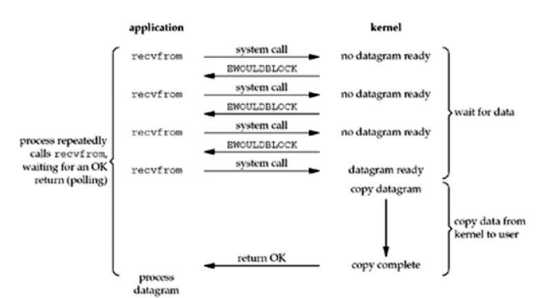
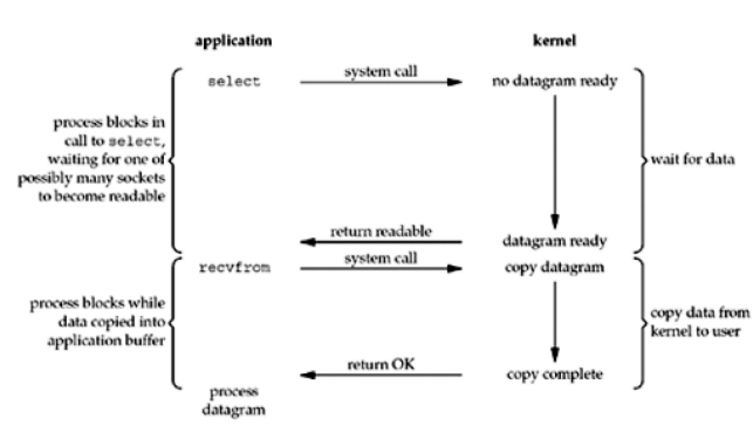
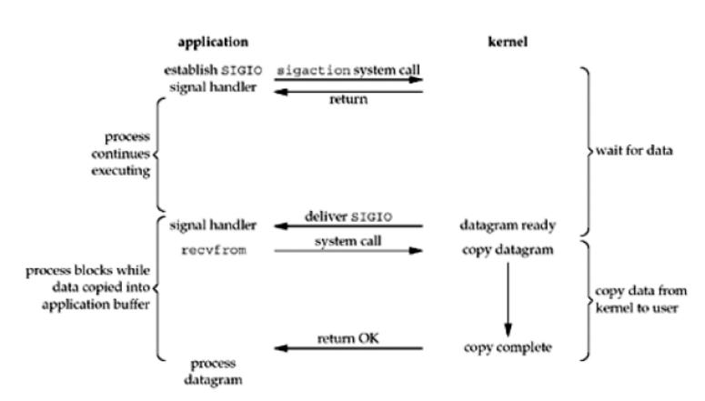
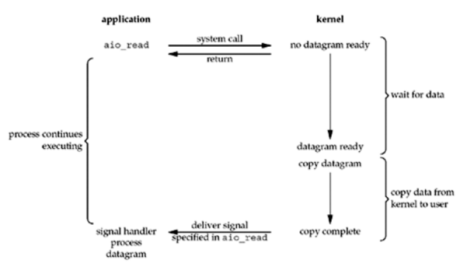

# IO

1.等待数据准备好（waiting for data to be ready）。对于一个套接口上的操作，这一步骤关系到数据从网络到达，并将其复制到内核的某个缓冲区。

2.将数据从内核缓冲区复制到进程缓冲区（copying the data from the kernel to the process）。

## BIO

=================================
## NIO  
1.操作时select轮询和polling

=================================

2.信号驱动

=================================
## AIO
